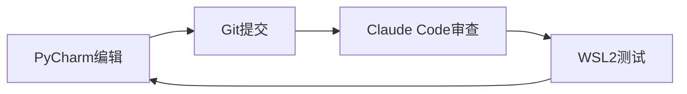

# PyCharm React开发环境配置指南

## 背景说明

本项目使用PyCharm作为主要IDE，通过Claude Code进行协作开发。本指南说明如何在PyCharm中配置React开发环境。

## 一、PyCharm版本要求

- **推荐版本**：PyCharm Professional 2023.3+
- **最低版本**：PyCharm Professional 2022.3+
- **注意**：Community版本对JavaScript/TypeScript支持有限

## 二、插件安装

### 必装插件

1. **JavaScript and TypeScript** 
   - 通常已内置，检查是否启用
   - 提供基础JS/TS语法支持

2. **React**
   - 支持JSX语法高亮和智能提示
   - React组件导航和重构

3. **Prettier**
   - 统一代码格式化
   - 支持.prettierrc配置

4. **ESLint**
   - JavaScript代码质量检查
   - 实时错误提示

### 可选插件

- **Tailwind CSS** - 如果使用Tailwind
- **Material Theme UI** - 更好的UI主题
- **Rainbow Brackets** - 彩虹括号

## 三、项目配置

### 1. 配置Node.js解释器

```
File → Settings → Languages & Frameworks → Node.js
- Node interpreter: E:\anaconda3\envs\stock-frontend\Scripts\node.exe
- Package manager: npm (自动检测)
```

### 2. 配置JavaScript

```
File → Settings → Languages & Frameworks → JavaScript
- JavaScript language version: React JSX
- Flow executable: (留空)
```

### 3. 配置TypeScript

```
File → Settings → Languages & Frameworks → TypeScript
- TypeScript: Bundled (或项目node_modules中的版本)
- 勾选 "Recompile on changes"
```

### 4. 配置代码风格

```
File → Settings → Editor → Code Style → JavaScript
- 基于: Prettier
- Tab size: 2
- Indent: 2
- 勾选 "Use semicolons"
```

## 四、运行配置

### 创建npm运行配置

1. Run → Edit Configurations
2. 点击 + → npm
3. 配置如下：
   ```
   Name: React Dev Server
   package.json: frontend/package.json
   Command: run
   Scripts: dev
   Node interpreter: 项目默认
   Environment variables: (留空)
   ```

### 创建npm构建配置

1. Run → Edit Configurations
2. 点击 + → npm
3. 配置如下：
   ```
   Name: React Build
   package.json: frontend/package.json
   Command: run
   Scripts: build
   ```

## 五、与Claude Code协作

### 工作流程



### 注意事项

1. **文件编码**：确保使用UTF-8
2. **换行符**：使用LF (Unix风格)
3. **Git配置**：
   ```bash
   git config core.autocrlf false
   git config core.eol lf
   ```

## 六、环境切换不影响集成

### 为什么不影响？

1. **文件系统共享**
   - Windows和WSL2共享同一文件系统
   - 通过/mnt/e访问Windows文件

2. **Git独立性**
   - Git配置独立于Python/Node环境
   - .git目录不受环境影响

3. **Claude Code工作方式**
   - 通过WSL2访问文件
   - 不依赖特定的conda环境

### 多环境管理建议

```powershell
# 查看所有环境
conda env list

# 后端开发
conda activate stock-analysis

# 前端开发
conda activate stock-frontend

# 环境间切换不影响文件和Git
```

## 七、常见问题

### Q1: PyCharm找不到node_modules？
```
File → Invalidate Caches → Invalidate and Restart
```

### Q2: ESLint不工作？
```
1. 确保项目根目录有.eslintrc配置
2. Settings → Languages & Frameworks → JavaScript → Code Quality Tools → ESLint
3. 选择 "Automatic ESLint configuration"
```

### Q3: 导入路径提示错误？
```
1. 右键frontend文件夹 → Mark Directory as → Sources Root
2. 配置webpack别名识别
```

### Q4: TypeScript编译错误？
```
1. 检查tsconfig.json配置
2. 确保TypeScript服务已启动
3. 重启TypeScript服务: Help → Find Action → "Restart TypeScript Service"
```

## 八、性能优化

1. **排除目录**：
   - node_modules
   - dist
   - .vite
   - coverage

2. **内存设置**：
   ```
   Help → Edit Custom VM Options
   -Xmx4096m
   -XX:ReservedCodeCacheSize=512m
   ```

3. **索引优化**：
   - 定期清理缓存
   - 排除大型二进制文件

## 九、推荐的项目结构

```
stock_analysis_system/
├── frontend/                 # React前端代码
│   ├── src/
│   ├── public/
│   ├── package.json
│   └── vite.config.ts
├── api/                      # Python后端代码
├── scripts/                  # 工具脚本
└── .idea/                    # PyCharm配置
    └── runConfigurations/    # 运行配置
```

这样的配置确保了PyCharm、Claude Code和多环境开发的完美协作。