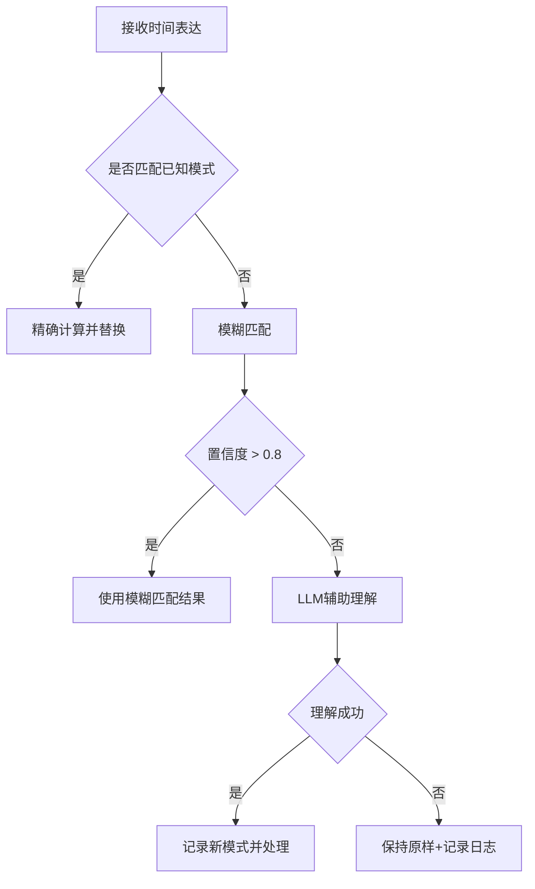

# 智能日期解析系统设计文档

**版本**: v2.0  
**更新日期**: 2025-06-23  
**作者**: Stock Analysis System Team

## 1. 概述

智能日期解析系统是股票分析系统的核心组件之一，负责将用户的自然语言时间表达转换为精确的交易日期。本文档定义了系统的设计原则、实现规范和扩展机制。

## 2. 核心原则

### 2.1 时间点 vs 时间段

**关键区别**：
- **时间点**（Point in Time）：指向单一的具体日期
  - 示例：`5天前`、`上周五`、`去年同期`
  - 结果：`2025-06-17`

- **时间段**（Time Range）：表示一个日期范围
  - 示例：`前5天`、`最近一周`、`过去一个月`
  - 结果：`2025-06-17至2025-06-23`

### 2.2 交易日定义

根据系统特殊算法，交易日换算规则如下：

| 时间单位 | 交易日数 | 说明 |
|---------|---------|------|
| 周 | 5 | 一周按5个交易日计算 |
| 月 | 21 | 一个月按21个交易日计算 |
| 季/季度 | 61 | 一季度按61个交易日计算 |
| 半年 | 120 | 半年按120个交易日计算 |
| 年 | 250 | 一年按250个交易日计算 |

### 2.3 年份相对日期处理

当处理"去年同期"等年份相对表达时：
1. 先改变年份（如2025→2024）
2. 检查结果日期是否为交易日
3. 如果不是交易日，向前搜索最近的交易日

## 3. 时间表达分类体系

### 3.1 时间点表达

#### 3.1.1 当前时间点
```python
patterns = ["最新", "今天", "今日", "现在", "当前", "目前", "本交易日"]
```

#### 3.1.2 相对时间点
```python
# 上一个周期
"上一个交易日" → -1个交易日
"昨天" → -1个交易日
"上周" → -5个交易日（上周最后一个交易日）
"上个月" → -21个交易日
"上个季度" → -61个交易日

# N个周期前
"5天前" → -5个交易日
"2周前" → -10个交易日
"3个月前" → -63个交易日
```

#### 3.1.3 年份相对
```python
"去年同期" → 年份-1 + 交易日修正
"前年" → 年份-2
"上上年" → 年份-2
```

### 3.2 时间段表达

#### 3.2.1 最近N个周期
```python
"最近5天" → 最近5个交易日范围
"最近一周" → 最近5个交易日范围
"最近一个月" → 最近21个交易日范围
"最近一个季度" → 最近61个交易日范围
```

#### 3.2.2 前/过去N个周期
```python
"前5天" → 过去5个交易日的范围
"过去一周" → 过去5个交易日的范围
"过去一个月" → 过去21个交易日的范围
```

#### 3.2.3 本周期
```python
"本周" → 本周一至今
"本月" → 本月1日至今
"本季度" → 本季初至今
"今年" → 今年初至今
```

## 4. 中文表达映射

### 4.1 中文数字
```python
CHINESE_NUMBERS = {
    "一": 1, "二": 2, "三": 3, "四": 4, "五": 5,
    "六": 6, "七": 7, "八": 8, "九": 9, "十": 10,
    "十一": 11, "十二": 12, "十五": 15, "二十": 20,
    "三十": 30, "半": 0.5, "俩": 2, "仨": 3
}
```

### 4.2 时间单位别名
```python
TIME_UNIT_ALIASES = {
    "天": ["天", "日"],
    "周": ["周", "星期", "礼拜"],
    "月": ["月", "个月"],
    "季": ["季", "季度", "个季度"],
    "年": ["年", "年度", "个年度"]
}
```

### 4.3 时间修饰词
```python
TIME_MODIFIERS = {
    "过去式": ["上", "上个", "上一个", "前", "之前"],
    "最近式": ["最近", "近", "这", "过去"],
    "当前式": ["本", "这个", "当前", "现在", "目前"]
}
```

## 5. 算法实现

### 5.1 时间点计算算法

```python
def calculate_point_date(expression_type: str, value: int, base_date: str = None) -> str:
    """
    计算具体的时间点
    
    Args:
        expression_type: 表达类型（days_ago, weeks_ago, months_ago等）
        value: 数值
        base_date: 基准日期，默认为最新交易日
        
    Returns:
        具体日期字符串（YYYY-MM-DD格式）
        
    Example:
        calculate_point_date("days_ago", 5) → "2025-06-17"
        calculate_point_date("weeks_ago", 2) → "2025-06-10"
    """
```

### 5.2 时间段计算算法

```python
def calculate_date_range(expression_type: str, value: int, end_date: str = None) -> Tuple[str, str]:
    """
    计算时间范围
    
    Args:
        expression_type: 表达类型（recent_days, past_weeks等）
        value: 数值
        end_date: 结束日期，默认为最新交易日
        
    Returns:
        (开始日期, 结束日期) 元组
        
    Example:
        calculate_date_range("recent_days", 5) → ("2025-06-17", "2025-06-23")
        calculate_date_range("past_months", 1) → ("2025-05-24", "2025-06-23")
    """
```

### 5.3 年份相对日期算法

```python
def calculate_year_relative_date(years_offset: int, base_date: str = None) -> str:
    """
    计算年份相对日期
    
    步骤:
    1. 将base_date的年份加上years_offset
    2. 检查结果日期是否为交易日
    3. 如果不是，向前搜索最近的交易日
    
    Example:
        # 假设2024-06-23是周日
        calculate_year_relative_date(-1, "2025-06-23") → "2024-06-21"
    """
```

## 6. 未知表达处理策略

### 6.1 处理流程



### 6.2 LLM辅助理解

对于系统无法直接识别的时间表达，使用LLM进行理解：

```python
常见非标准表达映射 = {
    "这几天": "最近3天",
    "前一阵子": "最近2周",
    "月初": "本月1日",
    "月底": "本月最后一个交易日",
    "季末": "本季度最后一个交易日",
    "最近一阵子": "最近2周"
}
```

### 6.3 错误处理原则

1. **不中断用户体验**：未识别的表达保持原样
2. **静默记录**：记录未识别表达供后续分析
3. **持续学习**：通过日志分析逐步完善模式库
4. **自然纠正**：通过用户后续反馈理解正确含义

## 7. 实现示例

### 7.1 完整示例表

| 用户输入 | 表达类型 | 处理结果 |
|---------|---------|----------|
| **时间点示例** |
| "最新股价" | CURRENT_POINT | "2025-06-23股价" |
| "昨天股价" | RELATIVE_POINT | "2025-06-20股价" |
| "5天前股价" | RELATIVE_POINT | "2025-06-17股价" |
| "上周股价" | RELATIVE_POINT | "2025-06-17股价" |
| "上个月股价" | RELATIVE_POINT | "2025-05-23股价" |
| "去年同期股价" | YEAR_RELATIVE | "2024-06-21股价" |
| **时间段示例** |
| "前5天走势" | TIME_RANGE | "2025-06-17至2025-06-23走势" |
| "最近一周表现" | TIME_RANGE | "2025-06-17至2025-06-23表现" |
| "最近一个月数据" | TIME_RANGE | "2025-05-24至2025-06-23数据" |
| "本周分析" | TIME_RANGE | "2025-06-17至2025-06-23分析" |
| "最近一季度报告" | TIME_RANGE | "2025-03-26至2025-06-23报告" |

### 7.2 边界情况处理

1. **非交易日处理**
   ```python
   if not is_trading_day(target_date):
       target_date = get_previous_trading_day(target_date)
       log.info(f"目标日期{original_date}非交易日，调整为{target_date}")
   ```

2. **数据不足处理**
   ```python
   if requested_days > available_days:
       log.warning(f"请求{requested_days}天数据，但仅有{available_days}天")
       # 返回所有可用数据
   ```

3. **未来日期处理**
   ```python
   if target_date > latest_trading_day:
       target_date = latest_trading_day
       log.info(f"目标日期{original_date}为未来日期，调整为最新交易日{target_date}")
   ```

## 8. 性能优化

### 8.1 缓存策略

```python
CACHE_CONFIG = {
    "交易日历": {
        "ttl": 86400,  # 24小时
        "scope": "global"
    },
    "日期计算结果": {
        "ttl": 3600,   # 1小时
        "scope": "session"
    },
    "LLM理解结果": {
        "ttl": 604800, # 7天
        "scope": "global"
    }
}
```

### 8.2 批量处理

对于包含多个时间表达的查询，采用批量处理优化：
1. 一次性识别所有时间表达
2. 批量查询交易日数据
3. 统一替换所有表达

## 9. 测试规范

### 9.1 单元测试覆盖

- 所有标准时间表达
- 边界情况
- 错误处理
- 性能基准

### 9.2 测试用例示例

```python
test_cases = [
    # 基础功能
    ("最新股价", "2025-06-23股价"),
    ("5天前数据", "2025-06-17数据"),
    
    # 复杂表达
    ("比较上周和本周表现", "比较2025-06-10至2025-06-14和2025-06-17至2025-06-23表现"),
    
    # 边界情况
    ("1000天前股价", "数据不足提示"),
    ("明天股价", "2025-06-23股价"),  # 自动修正为最新
]
```

## 10. 扩展机制

### 10.1 新增时间表达

1. 在配置文件中添加模式
2. 实现对应的计算函数
3. 添加测试用例
4. 更新文档

### 10.2 地域化支持

预留接口支持方言时间表达：
```python
DIALECT_MAPPINGS = {
    "粤语": {
        "寻日": "昨天",
        "前日": "前天"
    }
}
```

## 11. 版本历史

- v2.0 (2025-06-23): 完整重构，支持时间点/时间段区分
- v1.0 (2025-06-20): 初始版本，基础日期解析

## 12. 参考资料

- 中国股市交易日历规则
- 自然语言处理时间表达识别
- LangChain时间处理最佳实践